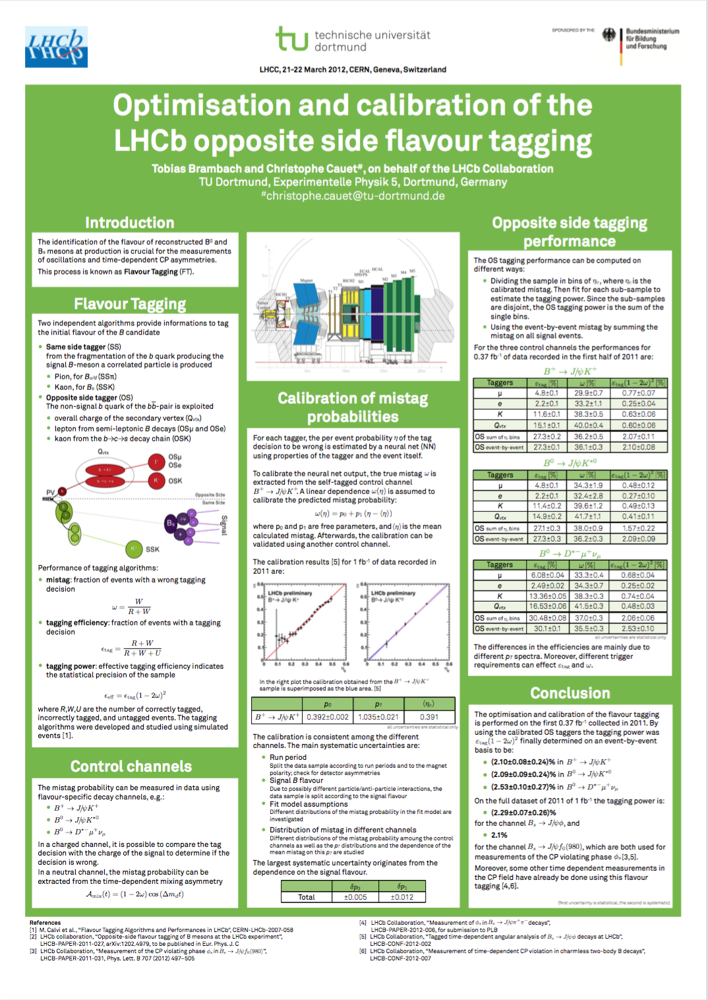

# Bestimmung der Lebenszeit neutraler D-Mesonen
**Fortgeschrittenen-Praktikum, M.Ed. GY Physik, SS2016, Universität Koblenz-Landau**

## Worum geht es?

Sie alle kennen die Konstituenten der Atome: Protonen und Neutronen bilden den Atomkern und bestehend ihrerseits wiederum aus Quarks, die Atomhülle ist gefüllt mit Elektronen. Die Teilchenphysik kennt darüber hinaus noch eine Vielzahl an weiteren Teilchen. Diese Teilchen und ihre Wechselwirkungen untereinander werden durch das Standardmodell der Teilchenphysik (SM) beschrieben.

Das SM beschreibt die elektromagnetische, schwache und starke Wechselwirkung und das Verhalten von Leptonen und Quarks unter diesen. Leptonen wie das Elektron und seine schweren Geschwister Myon und Tau unterliegen der elektro-schwachen Wechselwirkung, Quarks unterliegen zusätzlich noch der starken Wechselwirkung. Die elektrisch neutralen Neutrinos sind ebenfalls Leptonen wechselwirken jedoch nur schwach. Zu jedem Lepton und Quark existiert ein Anti-Teilchen mit gegensätzlicher Ladung, sonst aber identischen Eigenschaften.

Neben den aus drei Quarks zusammengesetzten Baryonen wie Neutron (_up_, _down_, _down_) und Proton (_up_, _up_, _down_), können sich auch Systeme aus einem Quark und einem Anti-Quark bilden, die sogenannten Mesonen. Eines dieser Mesonen, bestehend aus einem _charm_ und einem _anti-up_ Quark, ist das elektrisch neutrale _D^(0)_-Meson. Es ist instabil und zerfällt nach einer mittleren Lebensdauer von etwa einer halben Picosekunde (10^(-12)s).

Aufgabe in diesem Praktikumsversuch ist es die Lebenszeit von _D^(0)_-Mesonen zu messen, die im Zerfall in ein geladenes Pion (_π_) und ein gegensätzlich geladenes Kaon (_K_) nachgewiesen werden. 

Der Datensatz auf dem die Analyse durchgeführt wird, besteht aus Daten, die im Laufe des Jahres 2011 am [LHCb-Experiment](http://lhcb-public.web.cern.ch/lhcb-public/) aufgenommen wurden. Das LHCb-Experiment ist eines von vier großen Experimenten am Large Hadron Collider (LHC) am [Europäischen Teilchenphysiklabor CERN](http://home.cern). 

Im Rahmen des Projekts [_International Masterclasses – hands on particle physics_](http://www.physicsmasterclasses.org) in dem jedes Jahr Schülerinnen und Schüler nahgelegene Universitäten und Forschungsinstitute besuchen, entstand eine Software zur Analyse der Daten. Sie basiert auf dem [ROOT C++ Framework](https://root.cern.ch) und ermöglicht die Durchführung der Lebenszeitmessung auch ohne Programmierkenntnisse. Die Software ist frei verfügbar, so dass wir sie auch benutzen können.

## Vorbereitung

* Schauen Sie sich auf der offiziellen [Website](http://lhcb-public.web.cern.ch/lhcb-public/en/LHCb-outreach/masterclasses/en/) der LHCb-Masterclasses um.
* Lesen Sie die [Anleitung](http://lhcb-public.web.cern.ch/lhcb-public/en/LHCb-outreach/masterclasses/DEinstructions.pdf) zur Messung.
* Mit den folgenden Begrifflichkeiten sollten Sie sich erneut vertraut machen: _Lebensdauer & radioaktiver Zerfall, Elementarteilchen, Leptonen, Quarks, Hadronen (Baryonen & Mesonen), elementare Wechselwirkungen (elektro-magnetisch, schwach, stark), relativistische Kinematik insbesondere Vierer-Impulse und relativistische Invarianten, natürliche Einheiten, statistische & systematische Messunsicherheiten_.

#### Benutzen des eigenen Notebooks

Sie können gerne Ihr eigenes Notebook benutzen: [Installationseinleitung](http://lhcb-public.web.cern.ch/lhcb-public/en/LHCb-outreach/masterclasses/en/Downloads.html). Wenn Sie Fragen bzgl. der Installation der Software haben, sprechen Sie mich an.

## Ablauf

* **Montag, 30. Mai 2016, 8 Uhr c.t.**, Einführungsvorlesung zur Physik am LHC
* **Montag, 6. Juni 2016, 8 Uhr c.t.**, Durchführung des Versuchs mit kurzem mündlichen Antestat
* **Montag, 27. Juni 2016, 8 Uhr c.t.**, Präsentation der Ergebnisse

## Testat

Das Testat wird in Form einer Posterpräsentation durchgeführt. Jede Gruppe erstellt dazu ein Poster mit Ihren Versuchsergebnissen. Stellen Sie sich vor, Sie möchten die Ergebnisse Ihrer Messung auf einer Fachtagung dem interessierten Publikum vorstellen. 

Ihr Poster soll im Format DIN A0 (oder DIN B1) erstellt werden. Sie sind selbst für den Druck des Posters verantwortlich.

### Fragestellungen

* Welchen Zeilchenzerfall untersuchen Sie?
* Wie funktioniert eine Lebensdauer-Messung an einem Teilchendetektor?
* Warum eignet sich der LHCb-Detektor besonders gut für Messungen der Lebenszeit von Teilchen?
* Wie läuft die Selektion von Signal-Ereignissen ab?
* Welche Ursache haben Untergrund-Ereignisse?
* Warum eignet sich der Stoßparameter als diskrimierende Variable?
* Welche Eigenschaften muss ein Gütemaß erfüllen um sinnvoll eingesetzt zu werden?
* Wie gelingt die Messung der Lebenszeit obwohl der Datensatz nicht ausschließlich aus Signal-Kandidaten besteht?
* Sie führen mehrere Messungen für verschiedene Grenzen des Stoßparameters durch. Welche Messung ist die Beste?

### Hinweise

#### Inhalt

Den Inhalt des Posters können Sie nach Ihren eigenen Vorstellungen gestalten. Versuchen Sie sich in den Adressaten hineinzuversetzen. Wer schaut sich das Poster an? Welche Informationen sind für diese Person interessant und wichtig? Welches Vorwissen bringt der Betrachter mit? Welche Botschaft möchten Sie mit Ihrer Präsentation transportieren?

Allgemeine Hinweise zur Struktur der Präsentation:

* Einleitung
    * Beschreiben Sie kurz worum es geht, was Sie für eine Messung durchführen, welches Ziel Sie verfolgen
* Kontext
    * Wie ist Ihre Arbeit eingebettet? 
    * Was untersuchen Sie für einen Datensatz? 
    * Was sind die grundlegenden physikalischen Zusammenhänge? 
    * Welche Messungen existieren bereits? 
    * Zeichnet sich Ihre Messung besonders aus, wenn ja wodurch?
* Messung
    * Beschreiben Sie Ihre Messung, so dass ein außenstehender aber mit Teilchenphysik vertrauter Betrachter sie nachvollziehen kann.
* Ergebnisse
    * Wie lauten die Ergebnisse? 
    * Zeigen Sie interessante Plots!
* Diskussion
    * Was bedeutet Ihre Messung? 
    * Welchen Einfluss hat sie auf bereits existierende Messungen? 
    * Was zeichnet Ihre Messung aus und welche Schlüsse sollten aus ihr gezogen werden?

#### Beispiel-Poster

Falls Sie keinerlei Vorstellung haben, wie ein Poster aussieht, hier ein Beispiel. In den Fluren der verschiedenen Lehrstühle sind zahlreiche weitere Exemplare zu finden.

#### Software

Eine ungeordnete und sicherlich unvollständige Liste von Software um Poster zu erstellen. Schreiben Sie mir wenn Sie noch andere Programme kennen.

* [LaTeX](https://de.wikipedia.org/wiki/LaTeX) mit [Beamer](https://de.wikipedia.org/wiki/Beamer_(LaTeX))
* [OpenOffice](https://de.wikipedia.org/wiki/Apache_OpenOffice)
* [Apple Pages](https://de.wikipedia.org/wiki/Pages_(Software))
* [Microsoft Publisher](https://de.wikipedia.org/wiki/Microsoft_Publisher)
* [Microsoft Powerpoint](https://de.wikipedia.org/wiki/Microsoft_PowerPoint)
* [Adobe InDesign](https://de.wikipedia.org/wiki/Adobe_InDesign)
* [QuarkXPress](https://de.wikipedia.org/wiki/QuarkXPress)

## Literatur

### Anleitung zur LHCb-Masterclass

* [LHCb Masterclass Anleitung](http://lhcb-public.web.cern.ch/lhcb-public/en/LHCb-outreach/masterclasses/)

### Weiterführende Literatur

Eine _persönliche_ Auswahl:

* **Teilchen und Kerne**: Eine Einfuhrung in die physikalischen Konzepte; _Povh, Rieth, Scholz, Zetsche_; ISBN 978-3540680758
* **Elementarteilchenphysik**: Von den Grundlagen zu den modernen Experimenten; _Berger_; ISBN 978-3540231431
* **Introduction to Elementary Particles**; _Griffiths_; ISBN 978-3527406012

### Links

* [Masterclass Website](http://www.physicsmasterclasses.org/index.php)
* [CERN Website](http://home.cern)
* [LHCb Website](http://lhcb-public.web.cern.ch/lhcb-public/)
* [LHCb Masterclasses](http://lhcb-public.web.cern.ch/lhcb-public/en/LHCb-outreach/masterclasses/en/)
* [Particle Data Group – Review of Particle Physics](http://pdglive.lbl.gov/Viewer.action)
* [Netzwerk Teilchenwelt](http://www.teilchenwelt.de)
* [Weltmaschine](https://www.weltmaschine.de)

## Kontakt

Wenn Sie Fragen haben, schreiben Sie mir am besten eine Email oder kommen Sie in meine Sprechstunde.

**Email:** [fp-ld-2016@christophe.cauet.de](fp-ld-2016@christophe.cauet.de)   
**Sprechstunde:** tba
